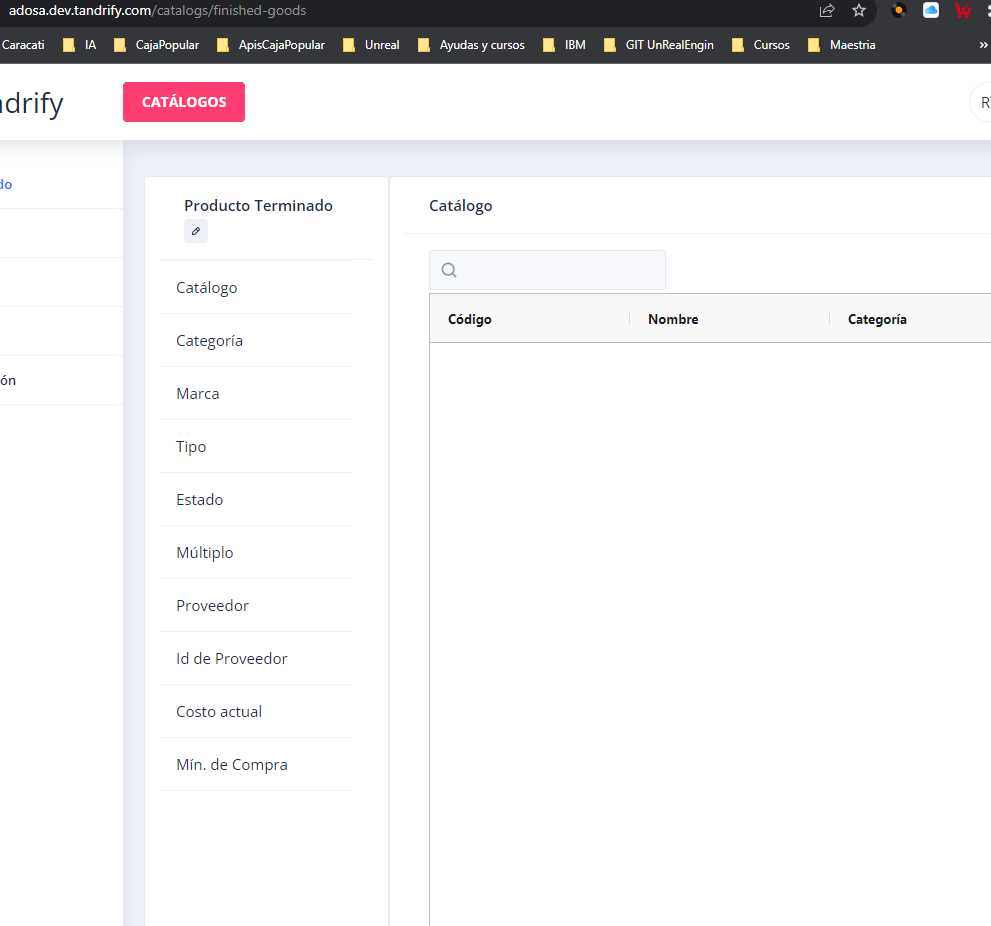
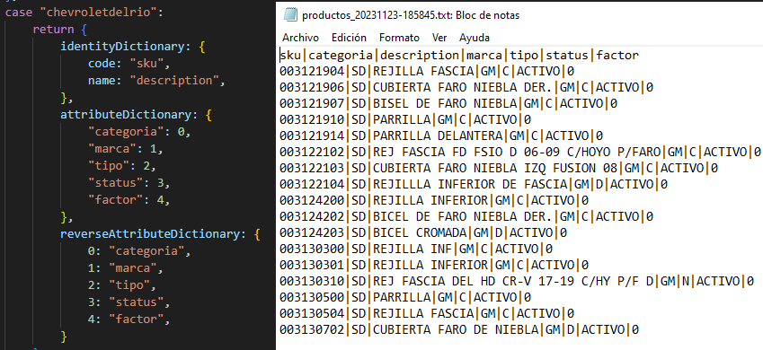

# Carga de nuevo cliente ejemplo con adosa
- Crear linea o lineas de demanda en la siguiente tabla
```sql
select * from tandrify.demandSetting where tenantId = 'adosa' -- da 46 la cual se usrará para el count y validar que se haya cargado bien la demanda
```

- Validar los archivos que se mandan para ver los nombres y agregarlos en lo catálogos
### Ejemplo de productos



### Ejemplo de ubicaciones
- En este cliente se mandaron solo code y description por los que todos los atributos van apagados, si se llegan a enviar otros atributos estos se deben de crear como el ejemplo de productos

## Ajustes en codigo
- Se hicieron ajustes en esta parte del codigo para agergar los diccionarios y también la parte de la carga de consumo

 - .../interface/common/dictionaries/demand.js  
 - .../interface/common/dictionaries/locations.js    
 - .../interface/common/dictionaries/products.js     
 - .../tenants/generic/interface/sale/app.js  
  
- Al tener esta información capturada en los catálogos y los ajustes en el codigo, se deben de subir los archivos en el directorio del bucket de s3 correspondiente en este caso tfy-interfaces-inboundbucket/adosa/ tanto para ubicaciones como productos y consumo

Para llenar o cargar la tabla de producto tienda es importante llenar la tabla "productAttributeField" manualmente para que se pueda utilizar y en el app.js del diccionario es importante que la llave vaya como viene en el documento y que el valor este como se haya cargado en al igual de agregar en tandrify el valor correspondiente en producto terminado

## Carga de consumos
- En este caso en la carga inicial se cargan todos los archivos de golpe
- Para validar la carga 

```sql
  select count(*) from demandResult dr where modelId = 46
```

Para acerias, se hizo lo siguintes, 
1- se creo la instancia de la forma que se tiene documenatada, agregando usarios, y persmisos 
2- posterior se creo la linea de demanda
3- se ajustó la lambda para poder tomar en cuenta dicha instancia
4- se cargaron los archivos de ubicacaciones, productos, producto tienda, inventario y consumo
5- también fue necesario agregar en select *
from tandrify.productAttributeField paf 
where tenantId = 'acerias'

## Notas al cargar nuevo Cliente orden y notas (Leer antes de empzar ya que hay pasos previos a la carga)
### Ubicaciones
- De igual forma se deben de registrar en el catlogo de Tándrify en ubicaciones dependiendo de lo que se tenga en el archivo txt 
  - validar tabla `locationAttributeLegend`
- Dentro del diccionario en tandrify validar los campos que se envian, si hay campos adicionales, se irám a buscar a esa tabla comentada para obtenerlos, de no ser asi revisar el ejemplo de adosa para que solo tome los 2 campos requeridos
### Productos
- Es importante validar el archivo y el diccionario que esta en Tandrify-sam-app/tentans/generic/interfaces/common/dictionaries
  - los nombres que vengan en el archivo a excepción del sku y description deben de estar dados de alta en el diccionario, el orden es importante como se muestra en producto terminado de la aplicación tandrify
    - 
  - Esto también debe de estar dado de alta en al la aplicación de tandrify dentro de producto terminado
  - validar tabla `productAttributeLegend`
### Producto ubicación
- Es imporatnte dar de alta en la tabla `productAttributeField` los registros que se estén enviando, ejemplo para chevroletdelrio agregando 2 nuevos registros es imporatante dar de alta los registros antes de hacer la carga de los arcvhiso
  ```sql 
  INSERT INTO tandrify.productAttributeField
  (tenantId, name, code, inactive, parentId)
  VALUES('chevroletdelrio', 'Descripcion', 9, 0, 1),('chevroletdelrio', 'Stock', 10, 0, 1);
  ``` 
### Inventario
- Revisar el diccionario dentro de dictionaries e inventory.js validar la estructura del txt enviado por el cliente si la información corresponde al baseDictionary solo agregarlo al 1er case de no ser asi agregar un nuevo case o valiar si se ajusta al default 

### Demanda
- De igual forma validar el diccionaro dentro de dictioaries y demand.js validar la estructrua del txt enviado por el cliente y valdiar si corresponde a algun case que se encuentre dentro del switch de no ser asi crear uno nuevo.