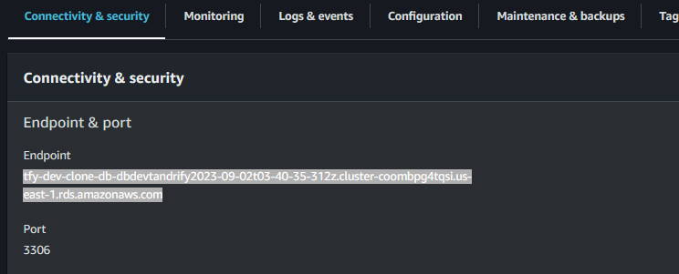
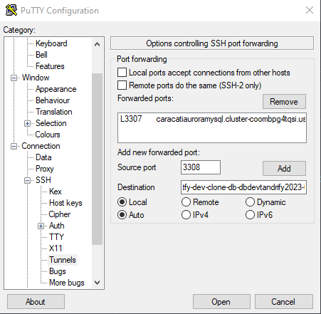

## Conexión a la base de datos de desarrollo
- Para la conexión a la base de datos de desarrollo es importante mencionar que la configuracion cambia día con día por lo que es necesario que dentro de putty se haga esta actualización ya que de no ser asi no se podría hacer la conexión

### Como tomar el destino nuevo que se hace por día ?
- Dentro de AWS - RDS - 
  - En la opocin de "Databases"
  - Seleccionar "tfy-dev-clone-dbdevtrandify......"
  - Tener en cuenta que lo ultimo será la fecha del respaldo por lo que eso es lo que cambiara
  - al estar dentro de la base de datos se en "Connectivity and securty" viene el Endpont y el puerto el cual deberá de configurarse en putty, *tener a la mano esta informacion*
  - 

### Conexión a Putty
- Al cargar la conexión aurora con la configuración definida hay que seguir los siguientes pasos
  - Dentro de "Category" que es el menú de lado izquierdo
    - En Connection - ssh - Tunnels
  - Se debera de agregar la información correspondiente, copiar el endpoint y agregarle : puerto quedando asi
  - tfy-dev-clone-db-dbdevtandrify2023-09-02t03-40-35-312z.cluster-coombpg4tqsi.us-east-1.rds.amazonaws.com:3306
    - Source port - Para que el tunnel utilice este puerto
    - Destination - endpoint mas puerto
      - Al finalizar agregarlo y con esto será posibile hacer la conexión a la base de datos de desarrollo
      - 