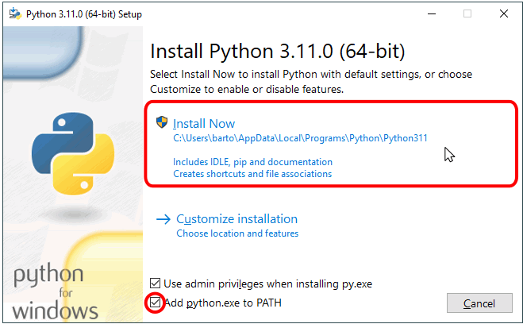
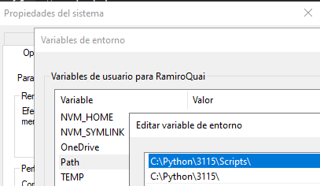

## Requisitios para poder trabjar con la aplicación Tandrify
- Para poder trabajar con la aplicación tandrify es necesario tener varios programas con versiones en especifico para que el sistema compile, y pueda desplegar servicios como lambdas en AWS, estas especificaciones son la siguientes, se recomienda tener estas versiones instaladas ya que se comprobó que al no tenerlas puede causar conflictos en deslpigues.

## Python 
- Actualmente a la fecha (2023-08-31) se utilizó la versión 3.11.5,
  - El primer paso es hacer la instalción **seleccionando la opción que agrague la ruta en el path**
  - Esto para que se genere dentro de las variables de ambiente el PATH necesario
  - 
  - Al finalizar la instalción dentro de las variables de sistema se deberán de observar las variables nuevas
  - 

## Cli AWS
- Para instalar una versión en especifico de AWS es necsario utilizar el comando pip, por esto es necesario primero tener instalado pyhton
  - dentro de una consola cdm o powershell es necesario ejecutar el siguiente comando
    ```cmd
    pip install awscli==1.18.9
  - Esto con el fin de tener esta version en especifico que es con la que se ha estado llevando el proyecto de forma correcta, y con esto poder ejecutar los comandos de SAM

## Sam
- Por ultimo es necesario instalar sam (Serveless aplication model) el cual nos permite desplegar funciones lambda en aws de forma rápida sin tener que hacer todo el despligue de la aplicación, par esto es necesrio entrar en el siguiente enlace
  - [Sam 1.21.1](https://github.com/aws/aws-sam-cli/releases/download/v1.21.1/AWS_SAM_CLI_64_PY3.msi)
- Esto descargará en automático un archivo llamado "AWS_SAM_CLI_64_PY3.msi" el cual hay que instalar 

## NODE
- Actualmente Tandrify usa la versión de node 14 esto viene especificado en el archivo "[Tandrify](03.Tandrify.md)" donde vienen también ejemplos para descargar, bajara o subir de versión utilizando el nvm

### Comandos de comprobación
```cmd
python --version
Python 3.11.5

aws --version
aws-cli/1.18.9 Python/3.11.5 Windows/10 botocore/1.15.9

sam --version
SAM CLI, version 1.21.1

