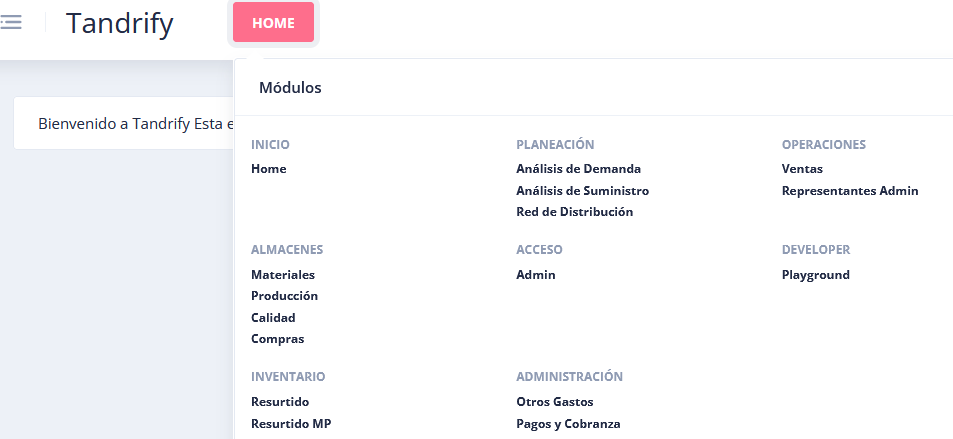

# Introducción al sistema
## _Introducción al sistema de tandrify_

### Descripción general
- Conocer mas de inventarios 
  - [Terminos logisticos](https://www.upct.es/~gio/GLOSARIO%20DE%20TERMINOS%20LOGISTICOS.pdf)
  - [Terminos de control de inventarios](https://www.anfix.com/blog/terminos-control-inventario)
  - [Glosario de terminos logisticos](https://www.movint.es/glosario-terminos-logisticos/)

### Glosario
- **SKU:** (*Stock Keeping Unit*) es un código único para identificar y seguir de manera individualizada un producto específico.
- **Leadtime:** Es el tiempo que transcurre desde que se inicia un pedido o una odrde de compra, hasta que se completa y se entega el producto al cliente.
- **Pie de camión:** Se refiere a la cantidad de productos o mercancías que caben en la parte trasera de un camión o vehículo de transporte.
- **Atributos:** Son las caracteristicas o propieaddes distintivas que se asocian a un producto o articulo especifico.
- **Clasificacion ABC:** (*Análisis ABC*) Es una técnica de gestión de inventarios que se utiliza para categorizar y clasificar los productos en función de su importancia relativa en términos de valor o volumen de ventas. 
- **Tiempos de revisión:** Se refieren al intervalo de tiempo entre las revisiones periódicas que se realizan para verificar el nivel de existencias de un determinado producto en el inventario.
- **Lift de demanda:** Sirve para medir el impacto de alguna estrategia o campaña de marketing en comparación con un escenario de referencia o base, puedes medir el lift de demanda comparando con las ventas sin la estrategia sobre las ventas con la estrategia
- **Linea de demanda**
- **Sustitutos** Cuando quieres agregar un nuevo producto sin demanda tomas el de algun otro para que lo puedas ofrecer

### Dudas - Comentarios
- Que hace el análisis de suministro?
- En prioridad se entiende que entre mas especifico sea, debe de ser mayor la prioridad, con esto se da a entender que si hay una ventana de tiempo que solo tome en cuenta un producto, este debe de tener la mayor prioridad y si hay alguna que sea con todos los productos en general se será prioridad 1
- En ABC, para determinar si es A y B se entiende que al establecer un valor del .12 en A y .25 en B se tomará lo ya obtenido para sobre esos productos asignalres al 12% los que son A y las 25% los que son B, lo C son lo que no entran en este rango y lo D son lo que no tuvieron ventas, esto usando volumen margen y costo.
- Al terminar con análisis de la demanda que se hace con esa información, se entiende que conforme se va avanzando se va disminuyendo la cantidad de productos que se quieren afectar en la politica, pero al finalizar con esto que se hace o como se trabaja con los prodcutos que quedan?
- En coberturas máximas se entiende que aunque se haya hecho una politica y esta tenga un valor maximo de 1000 si se cambia a 100 el valor maximo de este producto será de 100 esto igual en el minimo
- Cual es la diferencia entre coberturas y posiciones?
- A que se refiere las Q? en los tipos de pedido
- ¿Qué son las lineas de demanda?
- Usuarios - Es necesario estar en cognito, y en la base de datos y también tener un rol para poder ver información de la aplicación
- Se puede hacer el switch en las lambda para que apunte a dev

## Analisis de la demanda
 ### Filtros
- Es la primera opción a ser capturada, aquí es donde se determinan todos los productos que se desean tener para poder hacer una politica correcta
 ### Ventanas de tiempo
- En esta sección se toma un rango de tiempo para poder definir el consumo promedio diario de cada producto y su variabilidad
### Estadisticos
- Aquí se calculan los aspectos como la variabilidad, marten y consumo promedio de cada uno de los productos, se analiza la historia de ventas dentro de la ventan de tiempo y con esto se determina la clasificación ABC de cada producto
### Clasificacion ABC
- En esta sección se hará la clasificación ABC que la determina la parte de Estadisticos con base a las variables de volumen, margen costo y variabilidad
### Politicas
- Las politicas se establecen previamente a la clasificción ABC y aquí se ingresan los parámmetros que detemiarán los niveles de inventario de cada producto

## Red de distribución
- Nodos: Viene definido hacia donde van los productos (distributionnode es la tabla)
- Ranking: No se usa

## Conteos PT (Productos terminados)
- SE debe de escanear al menos uno, hay 2 conteos y hay un reporte de diferencias que sería el conteo 3.
- Cicliclos. Convinación de un producto con una tienda en cierta fecha o cierto día
- Tipo de inventario 1 es en stock o totalidad y el 2 es en transito 
- El conteo actual se usa solo par gilsa

## Contesos MP (Materias primas)
- No tiene funcionalidad actual

## TIASA MODULO OPERACIONES
- Ventas, transferncias, representantes individuales

# Almacenes 
- Materiales
- Producción : viene loas materias primas para hacer producto terminado
- Orden de trabajo es cuando ya tiene un producto terminado

## Resurtido
### Resurtido
  - 

### Tenants Actuales
- Que es un tentant?
  - Tentant es el identificador del cliente dentro de las tablas, el cual es un string.

- se debe de reigstar primero en dynamoDB
- TandrfiyClientConfiguration ahí vienen todos los tenants

   |Tentant|Nombre|Descripción|Notas de interes|Forma de subir interfaces|
   |-|-|-|-|-|
   |pasamx|pasa|-|Pertenece a tandrify 1|-|
   |amparts|Amparts|-|Interfaz genérica|Se suben de este lado|
   |chevroletdelrio|Chevrolet del Rio|-|Interfaz genérica|Se sube de este lado|
   |farmaciasdelahorro|Farmacias del ahorro|-|Interfaz genérica|Se sube de este lado|
   |deacero|Deacero|-|Interfaz genérica|Su forma de trabajar es difente por VPN|
   |gilsa|Gilsa alimentos|-|La lambda se encarga de determinar a donde mandar la información|Por SFTP, el bucket se llama tandrify-gilsa, el nombre de consumo debe de ser consumo_pedido consumo_entrega esto solo para consumo|
   |comercialtrevino|Comercial treviño|-|-|Suben de forma automatica al bucket|
   |tia|Tiasa|-|-|No utiliza la interface (Mantiene al tanto su invetanrio con su inventario del dia anterior, solo se utiliza para esto)|

- Se agregó una actualización para poder subir varios archivos de interface y no los vaya metiendo en cola y los trabaje a la par
- Cada interface tiene su forma de subir su información, se estará trabajando en alguna unica para todos, dentro del documento de layouts, viene especiicado los campos a mandar
- EN CODIGO en policy-query
- Esta la personalización por tenant
- Es importante tomar en cuenta que en el codigo se toman decisiones en especifico por cada uno de los tenant
- interface genereica "tfy-interfaces-inboundbucket"
- La lambda generica es "" y estas en el codigo "tentnats-generic buscar por genericinterfaces"
- typeORM no es recomendasble usarlo

### Referencias
-[Manual de TANDRIFY](0.Assests/ManualTandrify2.pptx)